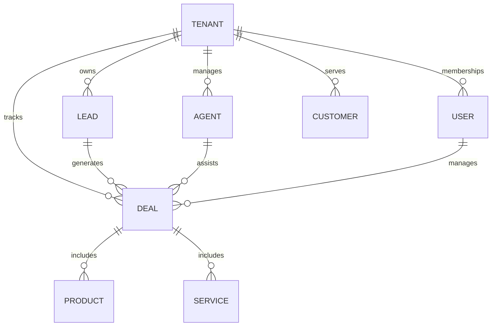

# Informe Técnico: Esquema de Base de Datos (Módulo Multi-Tenant)

Este documento describe la estructura de datos diseñada para soportar el Módulo de Revenues bajo una arquitectura multi-tenant y multi-agente.

## 1. Arquitectura Central
La base de datos utiliza un modelo de **datos compartidos con aislamiento lógico**. El aislamiento se garantiza mediante la columna `tenantId` en todas las entidades de negocio.

### Entidades de Identidad
- **User**: Usuarios globales del sistema. Un usuario puede pertenecer a múltiples tenants (agencias) con diferentes roles.
- **Tenant**: Representa a una agencia cliente. Es el nodo raíz de todos los datos de negocio.
- **Membership**: Vincula a un `User` con un `Tenant`, definiendo su `Role` (RBAC).

## 2. Diagrama de Relaciones Principales

## 3. Análisis de Capas (Módulo de Revenues)

### A. Capa de Adquisición (Leads)
El modelo `Lead` está optimizado para la automatización:
- **sourceType**: Identifica si viene de `SCRAPER`, `MANUAL`, `API` o `ADS`.
- **googlePlaceId**: Evita duplicados durante el scraping masivo.
- **potentialScore**: Campo calculado para que el agente IA priorice contactos.

### B. Capa Comercial (CRM)
- **Agent**: Cada agencia puede tener múltiples agentes IA (OpenAI Assistants).
- **Pipeline**: Fases de venta personalizables por cada tenant.
- **Deal**: Oportunidad de venta. Puede estar asignada a un humano (`assignedToUserId`) o a un agente IA (`assignedToAgentId`).

### C. Capa de Rendimiento (Métricas)
- **UserDailyMetrics**: Agregaciones diarias de actividad por usuario/tenant.
- **Activity**: Registro granular de acciones (llamadas, contactos, commits).

## 4. Hallazgos y Ajustes Recomendados (Fase 1)
Aunque el esquema actual es robusto, se han identificado las siguientes mejoras necesarias para garantizar la integridad referencial:

1.  **Relaciones Faltantes**: Agregar relaciones formales `@relation` en las tablas `Activity`, `Task`, `Project` y `UserDailyMetrics` hacia el modelo `Tenant`. Actualmente tienen el campo `tenantId` pero Prisma no gestiona la integridad referencial.
2.  **Unificación de Roles**: Sincronizar el Enum `Role` (línea 369) con el campo `membership.role` (línea 163) que actualmente es un `String`. Recomendamos usar el Enum para evitar errores de escritura.

---
**Fecha de Revisión:** 2026-03-03
**Estado:** Planificado para Fase 1
