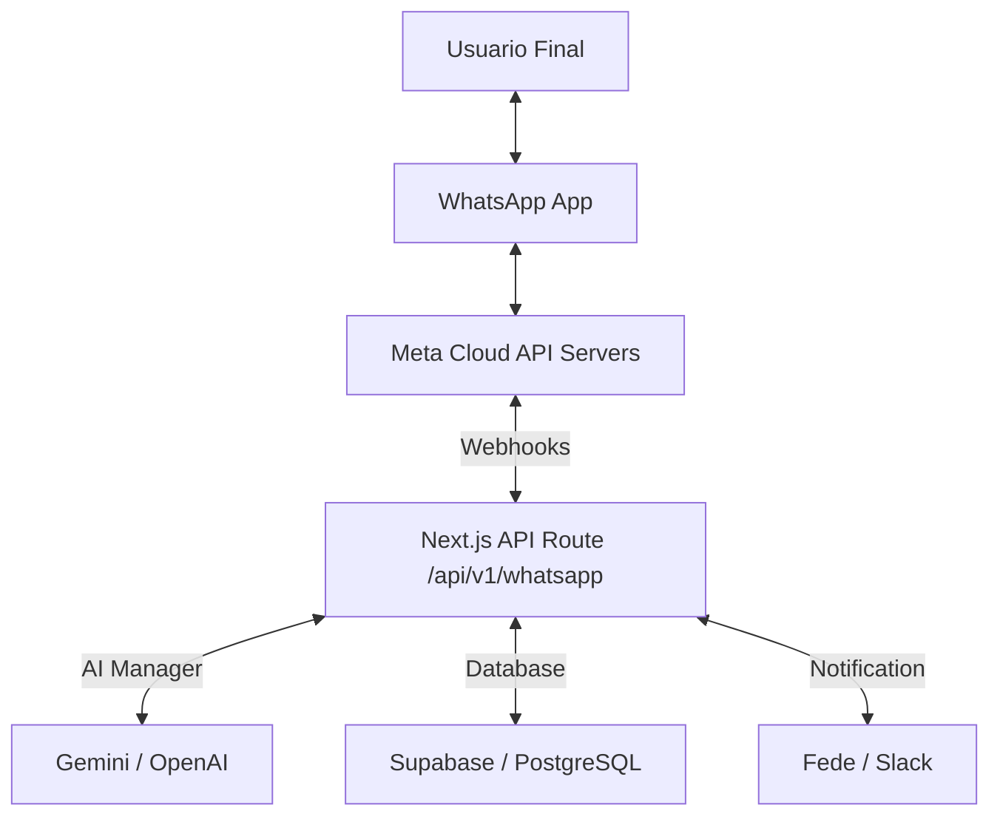

# Propuesta Técnica: WhatsApp Bot Integration (Meta Cloud API)

**Proyecto:** Agencia Web B2B  
**Solicitado por:** Fede (FCM)  
**Fecha:** 25 de Enero, 2026  
**Hora:** 02:18 AM (ART)  
**Documento:** 25-01-25_02-18_FCM_whatsapp-meta-bot-strategy.md  
**Sprint:** Sprint 5

---

## 1. Visión General: Control Total via Meta

Cambiamos la estrategia de integración para utilizar directamente la **WhatsApp Cloud API de Meta**. Esto elimina intermediarios (como Twilio), reduce costos operativos a los oficiales de Meta y nos otorga **control total** sobre la infraestructura del chat, permitiendo el uso de plantillas (templates) oficiales, botones interactivos y catálogos de manera directa.

---

## 2. Estrategia Directa (Meta vs Twilio)

| Característica  | Meta Cloud API (Estructura actual)                  | Twilio (Descartado)             |
| :-------------- | :-------------------------------------------------- | :------------------------------ |
| **Control**     | Total y directo desde el backend                    | Limitado por el SDK de Twilio   |
| **Costos**      | Precios oficiales de Meta (basados en conversación) | Recargo por mensaje de Twilio   |
| **Integración** | HTTP puro via API Graph                             | SDK cerrado                     |
| **Features**    | Acceso inmediato a nuevas funciones de Meta         | Retraso en adopción de features |

---

## 3. Arquitectura del Sistema

---

## 4. Componentes Críticos del Bot

1.  **Motor de Verificación (Webhook):** Endpoint persistente para validar el `Verify Token` de Meta.
2.  **Manejador de Mensajes Entrantes:** Lógica para discernir entre texto, botones de respuesta y ubicación.
3.  **AI Engine Intelligence:** Uso de LLMs para procesar lenguaje natural y extraer intenciones (calificación de leads).
4.  **Sistema de Notificaciones Directas:** Alertas inmediatas cuando se detecta un lead calificado o una solicitud de intervención humana.

---

## 5. Fases de Despliegue

### Fase 1: Meta Developer Setup

- Registro de App en Meta Developers.
- Validación de número oficial y registro de WABA (WhatsApp Business Account).
- Configuración del Webhook con `GET` verification.

### Fase 2: Recepción y Procesamiento

- Manejo de `POST` requests de Meta.
- Extracción de `wa_id`, `message_id` y `text_content`.

### Fase 3: AI Qualification

- Procesamiento del chat via AI para seguimiento automático (presupuesto, necesidad, timeline).

### Fase 4: Control & Dashboard

- Integración con el futuro Dashboard de administración para visualizar chats en tiempo real.

---

**Documento generado:** 25-01-25 02:18 AM (ART)  
**Autor:** Antigravity AI para Fede (FCM)  
**Versión:** 2.0 (Direct Meta Integration)
