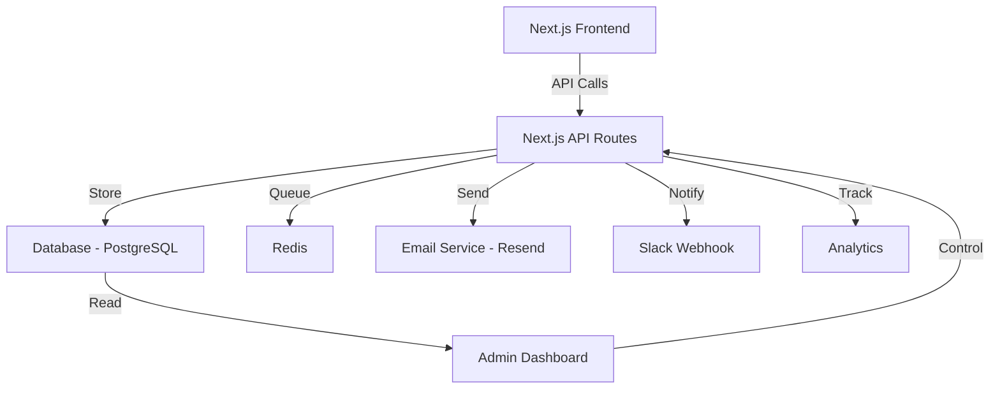

# Propuesta de Implementación - Backend API Expansion

**Proyecto:** Agencia Web B2B Landing Page  
**Solicitado por:** Fede (FCM)  
**Fecha:** 25 de Enero, 2026  
**Hora:** 01:21 AM (ART)  
**Documento:** Technical Proposal v1.0  
**Tipo:** Backend + Full Stack

---

## Contexto

Actualmente, el sitio Agencia Web B2B solo cuenta con **un endpoint** de backend:

```
POST /api/contact - Envío de formulario de contacto
```

Esta propuesta plantea expandir la funcionalidad backend para soportar features avanzadas que aumentarán la conversión y engagement del sitio.

---

## Propuesta: Backend API Expansion

### Objetivo

Crear una **suite completa de APIs** que soporten:

1. Sistema de leads con calificación automática
2. Newsletter subscription
3. Rate limiting inteligente
4. Webhooks para integraciones
5. Dashboard de administración

---

## Architecture Overview



---

## Proposed Features

### 1. Lead Management System

**Endpoint:** `POST /api/leads`

**Funcionalidad:**

- Recibir y almacenar leads en base de datos
- Scoring automático basado en datos del form
- Notificación instantánea vía Slack/Email
- Integración con CRM (HubSpot/Salesforce)

**Schema:**

```typescript
interface Lead {
  id: string;
  name: string;
  email: string;
  company?: string;
  message: string;
  source: "contact_form" | "pricing_cta" | "whatsapp";
  score: number; // 0-100
  status: "new" | "contacted" | "qualified" | "converted" | "lost";
  createdAt: Date;
  updatedAt: Date;
  metadata: Record<string, any>;
}
```

---

### 2. Newsletter System

**Endpoints:**

- `POST /api/newsletter/subscribe`
- `POST /api/newsletter/unsubscribe`
- `GET /api/newsletter/status/:email`

**Funcionalidad:**

- Double opt-in confirmation
- Segmentación por interés
- GDPR compliant
- Integración con Mailchimp/SendGrid

**Schema:**

```typescript
interface Subscriber {
  id: string;
  email: string;
  status: "pending" | "active" | "unsubscribed";
  interests: string[];
  subscribedAt: Date;
  confirmedAt?: Date;
  unsubscribedAt?: Date;
}
```

---

### 3. Rate Limiting & Anti-Spam

**Implementación:** `@upstash/ratelimit` con Redis

**Funcionalidad:**

- Limit per IP: 5 requests / 60 seconds
- Limit per email: 3 submissions / day
- CAPTCHA challenge after 3 failures
- Automatic IP blocking

**Código:**

```typescript
import { Ratelimit } from "@upstash/ratelimit";
import { Redis } from "@upstash/redis";

const ratelimit = new Ratelimit({
  redis: Redis.fromEnv(),
  limiter: Ratelimit.slidingWindow(5, "60 s"),
  analytics: true,
});

export async function POST(request: Request) {
  const ip = request.headers.get("x-forwarded-for") ?? "unknown";
  const { success } = await ratelimit.limit(ip);

  if (!success) {
    return new Response("Too Many Requests", { status: 429 });
  }

  // Process request...
}
```

---

### 4. Webhooks System

**Endpoint:** `POST /api/webhooks/:provider`

**Providers:**

- Slack
- Discord
- Zapier
- Make (Integromat)

**Funcionalidad:**

- Notificación en tiempo real de leads
- Sincronización bidireccional con CRM
- Alertas de formularios completados

**Ejemplo Slack Webhook:**

```typescript
export async function notifySlack(lead: Lead) {
  const webhookUrl = process.env.SLACK_WEBHOOK_URL;

  await fetch(webhookUrl, {
    method: "POST",
    headers: { "Content-Type": "application/json" },
    body: JSON.stringify({
      text: `🚀 Nuevo Lead: ${lead.name}`,
      blocks: [
        {
          type: "section",
          text: {
            type: "mrkdwn",
            text: `*Nuevo Lead (Score: ${lead.score}/100)*\n\n*Nombre:* ${lead.name}\n*Email:* ${lead.email}\n*Mensaje:* ${lead.message}`,
          },
        },
      ],
    }),
  });
}
```

---

### 5. Admin Dashboard API

**Endpoints:**

- `GET /api/admin/leads` - List leads with pagination
- `GET /api/admin/leads/:id` - Get lead details
- `PATCH /api/admin/leads/:id` - Update lead status
- `GET /api/admin/stats` - Dashboard statistics

**Autenticación:** NextAuth.js con Google OAuth

**Funcionalidad:**

- Visualizar todos los leads
- Filtrado y búsqueda
- Actualización de status
- Exportación a CSV
- Estadísticas y métricas

---

## Database Schema (PostgreSQL)

```sql
-- Leads table
CREATE TABLE leads (
  id UUID PRIMARY KEY DEFAULT gen_random_uuid(),
  name VARCHAR(255) NOT NULL,
  email VARCHAR(255) NOT NULL,
  company VARCHAR(255),
  message TEXT NOT NULL,
  source VARCHAR(50) NOT NULL,
  score INTEGER DEFAULT 50,
  status VARCHAR(50) DEFAULT 'new',
  created_at TIMESTAMP DEFAULT NOW(),
  updated_at TIMESTAMP DEFAULT NOW(),
  metadata JSONB
);

-- Subscribers table
CREATE TABLE subscribers (
  id UUID PRIMARY KEY DEFAULT gen_random_uuid(),
  email VARCHAR(255) UNIQUE NOT NULL,
  status VARCHAR(50) DEFAULT 'pending',
  interests TEXT[],
  subscribed_at TIMESTAMP DEFAULT NOW(),
  confirmed_at TIMESTAMP,
  unsubscribed_at TIMESTAMP
);

-- Webhooks log
CREATE TABLE webhook_logs (
  id UUID PRIMARY KEY DEFAULT gen_random_uuid(),
  provider VARCHAR(50) NOT NULL,
  event_type VARCHAR(100) NOT NULL,
  payload JSONB NOT NULL,
  status VARCHAR(20) NOT NULL,
  created_at TIMESTAMP DEFAULT NOW()
);
```

---

## Technology Stack

| Component    | Technology                   | Justification                     |
| ------------ | ---------------------------- | --------------------------------- |
| **Database** | PostgreSQL (Vercel Postgres) | Relacional, robusto, fácil deploy |
| **ORM**      | Prisma                       | Type-safe, excelente DX           |
| **Cache**    | Redis (Upstash)              | Serverless, rate limiting         |
| **Email**    | Resend                       | Developer-friendly, templates     |
| **Auth**     | NextAuth.js                  | Simplicity, OAuth integrado       |
| **Webhooks** | native fetch                 | Sin dependencias extras           |

---

## Implementation Phases

### Phase 1: Foundation (Week 1)

**Tipo:** Backend  
**Días:** 5

- ✅ Setup PostgreSQL database
- ✅ Configure Prisma ORM
- ✅ Create database schema
- ✅ Implement `/api/leads` endpoint
- ✅ Basic CRUD operations

### Phase 2: Advanced Features (Week 2)

**Tipo:** Backend + Full Stack  
**Días:** 5

- ✅ Newsletter subscription system
- ✅ Rate limiting with Redis
- ✅ Email notifications (Resend)
- ✅ Slack webhook integration

### Phase 3: Admin Dashboard (Week 3)

**Tipo:** Full Stack  
**Días:** 7

- ✅ NextAuth.js setup
- ✅ Admin UI (dashboard)
- ✅ Leads management interface
- ✅ Statistics and charts
- ✅ Export functionality

---

## Security Considerations

### 1. Authentication & Authorization

```typescript
import { getServerSession } from "next-auth";

export async function GET(request: Request) {
  const session = await getServerSession();

  if (!session || session.user.role !== "admin") {
    return new Response("Unauthorized", { status: 401 });
  }

  // Admin-only logic
}
```

### 2. Input Validation

```typescript
import { z } from "zod";

const leadSchema = z.object({
  name: z.string().min(2).max(100),
  email: z.string().email(),
  message: z.string().min(10).max(1000),
  company: z.string().optional(),
});

export async function POST(request: Request) {
  const body = await request.json();
  const validation = leadSchema.safeParse(body);

  if (!validation.success) {
    return Response.json({ error: validation.error }, { status: 400 });
  }

  // Process validated data
}
```

### 3. SQL Injection Protection

Prisma ORM protege automáticamente contra SQL injection mediante prepared statements.

---

## Cost Estimation

| Service             | Plan  | Costo Mensual               |
| ------------------- | ----- | --------------------------- |
| **Vercel Postgres** | Hobby | $0 (hasta 256MB)            |
| **Upstash Redis**   | Free  | $0 (hasta 10K requests/day) |
| **Resend**          | Free  | $0 (hasta 3K emails/month)  |
| **Vercel Hosting**  | Hobby | $0                          |

**Total:** $0/mes inicialmente, escalable según tráfico

---

## Deployment Strategy

### 1. Environment Variables

```env
# Database
DATABASE_URL="postgresql://..."
DIRECT_URL="postgresql://..."

# Redis
UPSTASH_REDIS_URL="https://..."
UPSTASH_REDIS_TOKEN="..."

# Email
RESEND_API_KEY="re_..."

# Webhooks
SLACK_WEBHOOK_URL="https://hooks.slack.com/..."

# Auth
NEXTAUTH_SECRET="..."
NEXTAUTH_URL="https://..."
GOOGLE_CLIENT_ID="..."
GOOGLE_CLIENT_SECRET="..."
```

### 2. Migration Strategy

```bash
# Generate Prisma client
npx prisma generate

# Run migrations
npx prisma migrate deploy

# Seed initial data
npx prisma db seed
```

---

## Success Metrics

Post-implementación, mediremos:

| Metric                   | Target                   |
| ------------------------ | ------------------------ |
| **Lead Capture Rate**    | +30%                     |
| **Response Time**        | <500ms (p95)             |
| **Email Deliverability** | >98%                     |
| **Admin Efficiency**     | -50% time managing leads |
| **Spam Prevention**      | <1% spam submissions     |

---

## Timeline Summary

| Phase                          | Duración | Tipo                 |
| ------------------------------ | -------- | -------------------- |
| **Phase 1: Foundation**        | 5 días   | Backend              |
| **Phase 2: Advanced Features** | 5 días   | Backend + Full Stack |
| **Phase 3: Admin Dashboard**   | 7 días   | Full Stack           |

**Total:** ~3 semanas (17 días laborables)

---

## Conclusion

Esta propuesta transforma el sitio de un **simple landing** a una **plataforma completa de lead generation y management**. La inversión en backend permitirá:

✅ **Automatización** - Reducir trabajo manual  
✅ **Escalabilidad** - Soportar crecimiento  
✅ **Insights** - Data-driven decisions  
✅ **Integraciones** - Conectar con todo el stack de ventas

---

**Documento generado:** 26-01-25 01:21 AM (ART)  
**Autor:** Antigravity AI para Fede (FCM)  
**Versión:** 1.0
