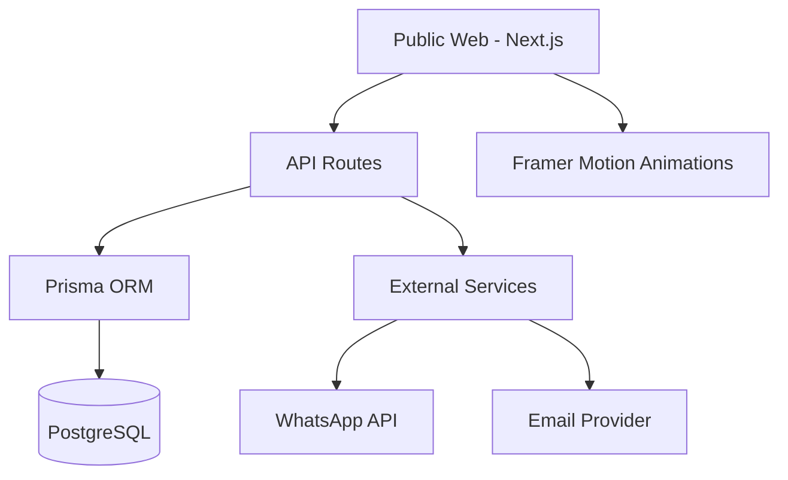

# Propuesta de Evolución V2: Ecosistema Digital B2B

**Fecha:** 25 de Enero, 2026  
**Propuesto por:** Antigravity AI  
**Nivel de Prioridad:** Alta (Crecimiento de Negocio)

---

## 1. Resumen Ejecutivo

Proponemos transformar la landing page actual en un **Ecosistema Digital B2B** que no solo informe, sino que gestione activamente el ciclo de vida del cliente. Esto implica pasar de una arquitectura _Frontend-Only_ a una de _Full-Stack Platform_.

## 2. Componentes de la Propuesta

### i. Backend Core & Database

- **Tecnología:** Supabase o PostgreSQL (self-hosted) + Prisma.
- **Objetivo:** Almacenamiento centralizado de leads, mensajes y métricas de interacción.

### ii. Lead Magnet Hub (Calculadora de ROI)

- **Feature:** Herramienta interactiva donde el cliente ingresa su facturación actual y visitas, y el sistema le devuelve una estimación de cuánto más podría facturar con una web optimizada por nosotros.
- **Valor:** Entrega valor inmediato y posiciona a la agencia como experta en resultados.

### iii. Client Portal (Alpha)

- **Feature:** Los clientes que contratan servicios pueden ver el progreso de su proyecto en un mini-portal privado.
- **Valor:** Diferenciación competitiva absoluta en el mercado de agencias.

### iv. Blog Engine (Markdown-based)

- **Feature:** Sistema de publicación de artículos técnicos optimizados para SEO.
- **Valor:** Autoridad técnica y tráfico orgánico recurrente.

## 3. Arquitectura Técnica Propuesta

## 4. Retorno de Inversión Esperado

- **Autoridad:** +100% percibido por el uso de herramientas interactivas.
- **SEO:** Top 10 para keywords relacionadas con "Agencia B2B" en 6 meses.
- **Conversión:** Duplicar el ratio de clicks en el formulario de contacto.

---
